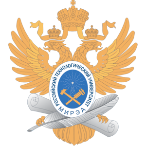

# Ответы на задания МИРЭА

***
#### ___Для чего это нужно?___
Мы сами являемся студентами МИРЭА и нам очень хорошо видна проблема многих людей. Есть идея, но не знаем как. С этой проблемой 
познакомились и мы, когда начали писать свой первый код на C++. В тот день нам пришлось провести много времени за компом в поисках 
ответов. И мы поняли, что такая проблема не только у нас, и многие выгарают, встретившись с такими трудностями.
Данный гит поможет и наставит вас на путь истинный.
***
#### ___Кто будет этим пользоваться?___
В первую очередь мы делаем это для себя, но на себе не ограничиваемся. Этим гитом может воспользоваться абсолютно любой студент
МИРЭА, которому понадобится помощь с прогой.
***
#### ___Но это же просто списывание!___
Мы категорически против копипастинга наших решений, но бывает так, что посмотрев решение, человек придумывает свой уникальный,
неповторимый способ, поэтому мы призывает людей разбираться в нашем коде, а не списывать его. От списывания вы не получите
никакой пользы, а разобравшись, сможете сами решить эту задачу.
***
> Sapere aude - латинское изречение, содержащееся в «Посланиях» Горация. Иммануил Кант перевел его как:
>> Имей мужество использовать свой собственный разум.